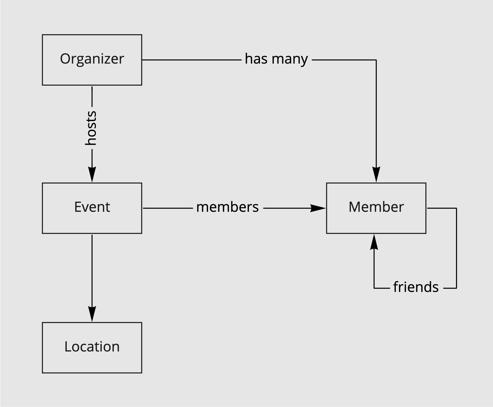

# Eventbook

Eventbook is a REST API for event management. Events can be of any kind, e.g. sports, concerts, meeting friends. Events can be public, protected or private. Public events are visible to anyone. Protected events are only seen by friends of the event's owner. Private events are visible to members only.

## Code Domain



## Build and deploy

```
GOOS=linux GOARCH=amd64 go build -o bin/app-amd64-linux main.go
scp bin/app-amd64-linux root@95.217.180.178:~
ssh root@95.217.180.178
nohup ./app-amd64-linux &
```


## API

### Authentication

```
./keycloak-login.sh localhost:8080 wingding ralf wingdingclient n
```

### Realms

```
GET    /admin/realms
POST   /admin/realms/
DELETE /admin/realms/{id}
```

### Events

```
GET    /{realm}/events
GET    /{realm}/events/{id}
POST   /{realm}/events
```

### Membership

```
GET    /{realm}/events/{id}/members
POST   /{realm}/events/{id}/members/{memberId}
DELETE /{realm}/events/{id}/members/{memberId}
```
