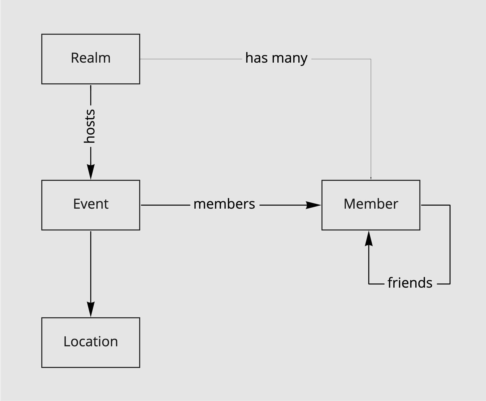

# Eventbook

Eventbook is a REST API for event managment. Events can be of any kind, e.g. sports, concerts, meeting friends. Events can be public, protected or private. Public events are visible to anyone. Protected events are only seen by friends of the event's owner. Private events are visible to members only.

## Code Domain



## API

```
GET  /{organizer}/events
GET  /{organizer}/{id}
POST /{organizer}/events

GET    /events/{id}/members
POST   /events/{id}/members
DELETE /events/{id}/members/{memberId}
```
